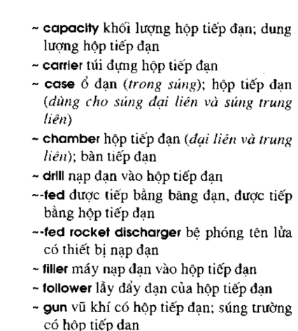
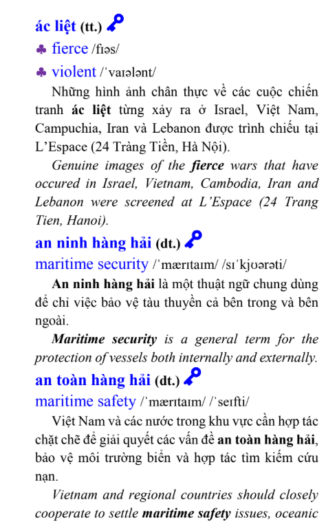

# 06 — Câu Hỏi Cần Chốt (Q&A) ✅ ĐÃ CHỐT

> File này liệt kê các điểm cần làm rõ trước khi code. **Khách đã trả lời** — phần dưới là câu trả lời đã được hoàn thiện lại cho rõ ràng, kèm tác động đến plan.
>
> Trạng thái: hầu hết đã chốt. Còn **2 việc cần khách gửi thêm**: (1) file PDF định nghĩa chương (A3), (2) xác nhận có máy Mac để build iOS (E1).

---

## 🔴 A. DỮ LIỆU TỪ VỰNG (quan trọng nhất — quyết định cả dự án)

### A1. File PDF nguồn

Bạn nói "phân tích dữ liệu từ file PDF". Xin cho biết:

- Bạn đã có file PDF chưa? Gửi cho tôi được không?
- Nội dung PDF là gì? (từ điển Anh–Việt tổng quát / giáo trình từ vựng theo chương / danh sách từ chuyên ngành?)

📌 *Đề xuất mặc định:* cần xem file thực tế mới phân tích được cấu trúc. **Rất mong nhận được file PDF sớm** vì đây là rủi ro lớn nhất.

✍️ **Trả lời (đã chốt):**

- **Đã có file PDF.** Đây là **giáo trình từ vựng tiếng Anh**, mỗi mục từ trình bày đầy đủ: từ tiếng Anh, phiên âm, loại từ, nghĩa tiếng Việt, ví dụ và hình ảnh minh họa (xem ảnh chụp nội dung bên dưới).
- **Hành động:** file này là **nguồn chính** để sinh cơ sở dữ liệu (`vocab.db`). Cần gửi file PDF gốc (bản mềm) để viết script parse.

Nội dung trong file PDF

---

### A2. Cấu trúc dữ liệu trong PDF

Mỗi từ trong PDF có sẵn những trường nào?

- [X] Từ tiếng Anh
- [X] Nghĩa tiếng Việt
- [X] Phiên âm (IPA)
- [X] Loại từ (n/v/adj...)
- [X] Ví dụ
- [X] Hình ảnh

📌 *Đề xuất mặc định:* nếu PDF thiếu phiên âm/ví dụ, tôi sẽ để trống các trường đó (không bịa dữ liệu). Trường nào không có sẽ ẩn trên giao diện.

✍️ **Trả lời (đã chốt):**

- PDF có **đầy đủ 6 trường**: từ tiếng Anh, nghĩa tiếng Việt, phiên âm (IPA), loại từ, ví dụ, hình ảnh.
- **Hành động:** schema DB và giao diện sẽ hỗ trợ đầy đủ cả 6 trường. Script parse cần bóc tách chính xác từng trường; trường nào một số mục thiếu thì để trống (không bịa).

---

### A3. Chia chương (11 chương)

- "11 chương" là cố định hay có thể thay đổi?
- Cách chia chương lấy từ đâu (có sẵn trong PDF, hay tôi tự chia theo chủ đề/thứ tự)?
- Mỗi chương khoảng bao nhiêu từ?

📌 *Đề xuất mặc định:* theo đúng cách chia sẵn trong PDF. Nếu PDF không chia, cần bạn cung cấp quy tắc chia.

✍️ **Trả lời (đã chốt — còn cần file):**

- Cách chia chương lấy từ **một file PDF khác** (PDF thứ 2 định nghĩa danh mục chương/bài).
- **Hành động / còn thiếu:** ⏳ **Cần khách gửi thêm file PDF thứ 2 này** để xác định số chương (dự kiến 11), tên từng chương và cách ánh xạ từ vựng vào từng chương. Chưa có file này thì chưa dựng được chức năng "Học theo chương" (FR-3).

---

### A4. Phạm vi tra cứu từ vựng

Khi người dùng tra một từ bất kỳ:

- (a) Chỉ tra trong **các từ thuộc PDF** (vài trăm–vài nghìn từ của giáo trình), HAY
- (b) Cần một **từ điển Anh–Việt đầy đủ** (hàng chục nghìn từ) để tra được mọi từ?

📌 *Đề xuất mặc định:* Phương án (a) cho MVP (đơn giản, đúng phạm vi giáo trình). Nếu cần (b) thì phải bổ sung nguồn từ điển mở khác (Wiktionary / từ điển Anh–Việt mở) và kiểm tra bản quyền → tốn thêm thời gian.

✍️ **Trả lời (điền theo mặc định — mời khách xác nhận):**

- Chọn **(a)** — chỉ tra trong phạm vi các từ thuộc PDF. Phù hợp phạm vi giáo trình, giữ app gọn nhẹ và offline 100%. (Nhất quán với B1 = tra từ trong DB.)
- **Có thể mở rộng** sang từ điển Anh–Việt đầy đủ ở phiên bản sau nếu khách yêu cầu.

---

### A5. Hình ảnh minh họa từ vựng

- Hình ảnh minh họa cho từ do ai cung cấp? (có sẵn trong PDF / bạn gửi bộ ảnh / tôi tự tìm?)
- Nếu tự tìm: có ràng buộc bản quyền không?

📌 *Đề xuất mặc định:* Hình ảnh là **không bắt buộc** (đúng như yêu cầu). MVP sẽ không có ảnh; bổ sung sau nếu có nguồn ảnh hợp lệ.

✍️ **Trả lời (đã chốt):**

- Hình ảnh **có sẵn trong PDF** → trích xuất và dùng luôn; **bổ sung thêm nếu cần**.
- **Hành động:** script parse sẽ trích ảnh từ PDF, lưu vào `assets/images/` và gắn đường dẫn vào cột `image_path` của bảng `words`. Giao diện hiển thị ảnh khi có.

---

## 🟠 B. CHỨC NĂNG DỊCH (rủi ro kỹ thuật cao vì yêu cầu Offline)

### B1. Mức độ dịch mong muốn

Dịch **offline** cả câu đúng ngữ pháp là rất khó và nặng. Bạn cần mức nào?

- (a) **Tra từ / cụm từ** trong DB (word-by-word) — offline, đơn giản, chất lượng cơ bản.
- (b) **Dịch cả câu** mượt như Google Translate — thường cần **API online** (vi phạm offline) hoặc nhúng mô hình AI offline rất lớn/phức tạp.

📌 *Đề xuất mặc định:* Phương án (a) để giữ offline 100%. Giao diện giống Google Translate nhưng thực chất là tra từ ghép lại. Nếu khách bắt buộc chất lượng câu (b) → cần chấp nhận dùng internet cho riêng chức năng dịch.

✍️ **Trả lời (đã chốt):**

- Chọn **(a)** — dịch offline bằng cách **tra từ/cụm từ trong DB**. Giao diện kiểu Google Translate (ô nhập, đổi chiều Anh↔Việt, kết quả) nhưng bản chất là tra từ ghép lại → **giữ offline 100%**, không cần internet.

---

## 🟡 C. SPLASH SCREEN & THƯƠNG HIỆU

### C1. Ảnh Cảnh sát biển Việt Nam

- Bạn cung cấp bộ ảnh chứ? Khoảng bao nhiêu tấm cho carousel?
- Ảnh có được phép sử dụng (bản quyền/nội bộ) không?

✍️ **Trả lời (đã chốt):**

- Trước mắt **đội phát triển tự dựng** phần splash chủ đề Cảnh sát biển Việt Nam (dùng ảnh/hình placeholder tự thiết kế, khoảng **3–5 ảnh** cho carousel).
- **Hành động:** làm splash với ảnh tạm mang phong cách Cảnh sát biển; **sẽ thay bằng ảnh chính thức** khi khách cung cấp bộ ảnh có bản quyền.

### C2. Tên app, logo, màu chủ đạo

- Tên hiển thị của app?
- Có logo/bộ nhận diện màu sắc riêng không?

📌 *Đề xuất mặc định:* Nếu chưa có, tạm dùng tông xanh biển (phù hợp chủ đề Cảnh sát biển) + tên tạm.

✍️ **Trả lời (đã chốt):**

- **Logo:** dùng logo **Cảnh sát biển Việt Nam**.
- **Màu chủ đạo:** theo bộ nhận diện các web/app hiện tại của Cảnh sát biển Việt Nam — chủ đạo **xanh dương đậm (navy) + trắng**, điểm nhấn vàng (theo phù hiệu). Sẽ lấy màu chính xác từ các trang chính thức để dựng theme.
- **Hành động:** cần khách gửi file logo độ phân giải cao; tạm dùng bản dựng lại nếu chưa có.

---

## 🟢 D. ÔN TẬP & THÔNG BÁO

### D1. Cơ chế lịch ôn tập

- (a) Thuật toán **lặp lại ngắt quãng SM-2** (thông minh, giãn dần theo mức nhớ) — như TFlat, HAY
- (b) Nhắc theo **khoảng cố định** đơn giản (ví dụ ôn lại sau 1 ngày, 3 ngày, 7 ngày)?

📌 *Đề xuất mặc định:* (a) SM-2 — hiệu quả và gần với TFlat.

✍️ **Trả lời (đã chốt):**

- Chọn **(a)** — dùng thuật toán **lặp lại ngắt quãng SM-2** (giãn khoảng ôn theo mức độ nhớ của từng từ), tương tự cơ chế TFlat.

### D2. Thông báo nhắc học

- Thông báo có cần chạy **khi app đã đóng** không?
- Lưu ý: trên **Windows desktop**, thông báo khi app đóng rất hạn chế (khác điện thoại). Trên iOS thì hỗ trợ tốt.

📌 *Đề xuất mặc định:* Trên Windows: nhắc trong lúc app đang mở (in-app + system notification). Trên iOS: dùng local notification đầy đủ. Nhắc nền khi tắt app trên Windows = ngoài phạm vi MVP.

✍️ **Trả lời (đã chốt):**

- **Windows:** nhắc trong lúc app đang mở (thông báo in-app + system notification).
- **iOS:** dùng local notification đầy đủ (nhắc kể cả khi app không mở).
- Nhắc nền khi đã **tắt hẳn app trên Windows** = **ngoài phạm vi MVP** (hạn chế kỹ thuật).

---

## 🔵 E. NỀN TẢNG & TRIỂN KHAI

### E1. iOS

- Bạn/khách có máy **Mac** và tài khoản **Apple Developer (99$/năm)** không?
- (Bắt buộc để build & phát hành app iOS — không có Mac thì không thể build iOS.)

✍️ **Trả lời (đã chốt — cần xác nhận thêm):**

- **Chưa cần đẩy App Store** ở giai đoạn này. iOS chỉ cần **build & cài qua chế độ Developer** để chạy thử → chưa cần tài khoản Apple Developer trả phí.
- ⚠️ **Lưu ý còn cần xác nhận:** để build iOS **vẫn bắt buộc có một máy Mac + Xcode**. Nếu hiện chưa có Mac thì phần iOS sẽ **làm sau** (ưu tiên Windows trước như kế hoạch); kiến trúc Flutter đã sẵn sàng để chuyển sang iOS khi có máy.

### E2. Cách phát hành Windows

- File cài đặt (`.exe`/`MSIX`) hay bản chạy trực tiếp (portable folder)?

📌 *Đề xuất mặc định:* Đóng gói MSIX hoặc bộ cài đơn giản.

✍️ **Trả lời (điền theo mặc định — mời khách xác nhận):**

- Đóng gói **bộ cài MSIX** (hoặc installer đơn giản) cho Windows.
- Kèm thêm **bản portable** (thư mục chạy trực tiếp) để tiện chạy thử nhanh trong quá trình phát triển.

### E3. Android?

- Có cần chạy Android không? (Dùng Flutter nên thêm Android gần như không tốn thêm nhiều công.)

✍️ **Trả lời (đã chốt):**

- **Có** — bổ sung **Android** vào phạm vi (Flutter hỗ trợ sẵn, thêm ít công).
- **Thứ tự ưu tiên nền tảng cập nhật:** **Windows (chính) → Android → iOS.**

---

## ⚪ F. BÁO CÁO & PHẠM VI CHUNG

### F1. Báo cáo Word

- Có mẫu/template quy định sẵn không? Viết bằng tiếng Việt?

📌 *Đề xuất mặc định:* Viết tiếng Việt, theo các mục khách yêu cầu (công nghệ, kiến trúc, DB, chức năng, hướng dẫn dùng & triển khai).

✍️ **Trả lời (điền theo mặc định — mời khách xác nhận):**

- Viết bằng **tiếng Việt**, chưa có template riêng → dùng bố cục chuẩn: mục lục + các phần: công nghệ sử dụng, kiến trúc ứng dụng, thiết kế CSDL, vị trí lưu trữ dữ liệu, giải thích chức năng chính, hướng dẫn sử dụng & triển khai.
- Nếu khách có **mẫu quy định**, gửi để làm theo.

### F2. Thời hạn (Deadline)

- Có mốc thời gian bàn giao không?

✍️ **Trả lời (chưa có — mời khách bổ sung):**

- Chưa có deadline cụ thể. Sẽ bàn giao **theo từng giai đoạn** trong roadmap ([05](./05-lo-trinh-phat-trien.md)). ⏳ Đề nghị khách xác nhận mốc thời gian nếu có để sắp xếp ưu tiên.

### F3. Tài khoản & đồng bộ

- Cần đăng nhập / đồng bộ nhiều máy không, hay hoàn toàn cục bộ trên 1 máy?

📌 *Đề xuất mặc định:* Hoàn toàn cục bộ (không tài khoản, không cloud) — đúng tinh thần offline.

✍️ **Trả lời (điền theo mặc định — mời khách xác nhận):**

- **Hoàn toàn cục bộ** trên 1 máy: không đăng nhập, không đồng bộ cloud — đúng tinh thần offline.
- Có thể bổ sung **backup/restore thủ công bằng file** nếu khách muốn chuyển dữ liệu giữa các máy.

---

## 📋 Tổng hợp trạng thái

### ✅ Đã chốt
- **A1, A2, A5** — nguồn dữ liệu chính là PDF giáo trình, đủ 6 trường, có ảnh trong PDF.
- **A4** — (a) chỉ tra từ trong phạm vi PDF.
- **B1** — (a) dịch offline bằng tra từ/cụm từ.
- **C1, C2** — splash & thương hiệu theo Cảnh sát biển VN (tự dựng tạm, màu navy + trắng).
- **D1, D2** — ôn tập SM-2; thông báo: Windows khi mở app, iOS đầy đủ.
- **E3** — thêm Android. Ưu tiên: **Windows → Android → iOS**.
- **E2, F1, F3** — theo phương án mặc định (chờ khách xác nhận nhẹ).

### ⏳ Còn cần khách cung cấp / xác nhận
1. **File PDF gốc (bản mềm)** của giáo trình từ vựng (A1) — để viết script parse.
2. **File PDF thứ 2 định nghĩa chương** (A3) — để dựng chức năng học theo chương.
3. **Có máy Mac hay không** (E1) — quyết định thời điểm làm iOS.
4. **File logo Cảnh sát biển** độ phân giải cao (C2) — nếu có.
5. **Deadline** (F2) — nếu có.

> Sau khi nhận được các mục ⏳ ở trên, tôi sẽ cập nhật các file plan cho khớp (đặc biệt: thêm Android, xác nhận A4=a, trích ảnh từ PDF) và bắt đầu **Giai đoạn 0 — khởi tạo project Flutter chạy trên Windows**.
